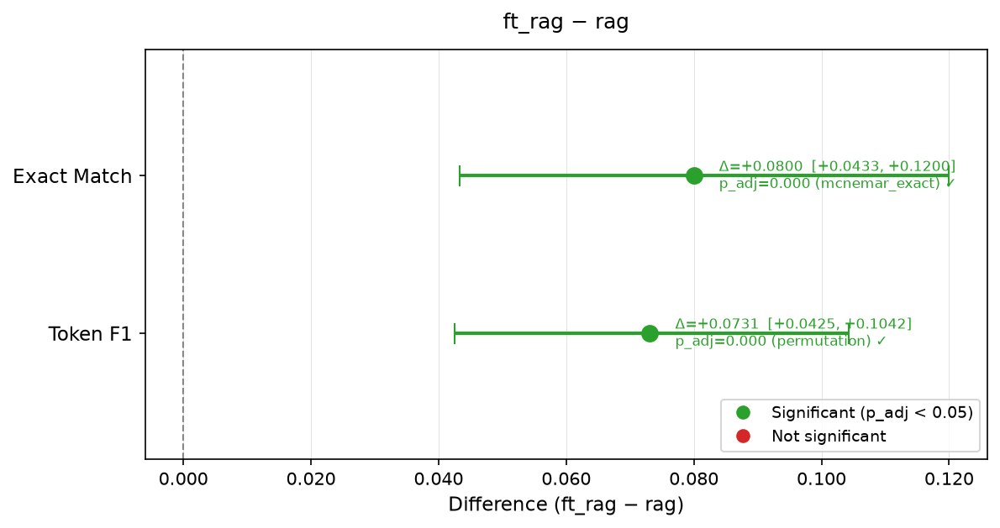

# llm-rag-ft-bench

Statistically rigorous comparison of **base · RAG · QLoRA fine-tuned · fine-tuned + RAG** configurations of Qwen3-8B on FinQA and TAT-QA financial QA benchmarks. Every number comes from a real MLflow run on a frozen, pre-registered eval set. A FastAPI server lets you query any configuration from the command line.

[]()
[]()
[]()

---

## Headline result



**All five pre-registered contrasts are statistically significant** (Holm–Bonferroni adjusted α = 0.05, N = 300). The ranking on Exact Match is ft_rag (19.0%) > rag (11.0%) > ft (4.3%) > base (0.7%). QLoRA fine-tuning adds a statistically significant but smaller increment on top of retrieval (C5: EM Δ = +0.080, 95% CI [+0.043, +0.120], McNemar exact, p_adj < 0.001); retrieval access to source tables remains the dominant driver of accuracy.

Full results and all five forest plots: [`reports/full_comparison.md`](reports/full_comparison.md).

---

## 3-command quickstart

```bash
git clone https://github.com/agniva-das/llm-rag-ft-bench && cd llm-rag-ft-bench
docker compose up -d
curl -X POST 'localhost:8000/ask?config=rag' \
     -H 'Content-Type: application/json' \
     -d @examples/question.json
```

The `rag` config requires the Qdrant collection to be populated first (see [Reproduce everything](#reproduce-everything)). For a self-contained smoke test use `config=base` (no Qdrant required, but model weights must be downloaded).

---

## Methodology

### Pre-registered design

The experiment design was written and frozen in [`EXPERIMENT.md`](EXPERIMENT.md) **before** any fine-tuning results were observed. It specifies configurations, eval-set construction, metrics, statistical tests, and a multiple-comparison policy. No amendments were made after Phase 3 closed.

### Eval set

300 questions drawn from two public financial-QA benchmarks:
- **FinQA test split** (150 questions) — multi-step numerical reasoning over S&P 500 10-K tables.
- **TAT-QA dev split** (150 questions) — hybrid table + text questions over annual reports.

The eval set overlaps zero IDs with the fine-tuning set (FinQA train + TAT-QA train, 13,876 examples). The zero-overlap assertion is enforced by a pytest test that runs in CI.

### Metrics

| Metric | Description |
|---|---|
| **Exact Match (EM)** | Normalised string equality after lower-casing and stripping punctuation. For numeric answers, tolerance-based matching (±1%) is used. |
| **Token F1** | Unigram overlap between prediction and reference after the same normalisation. |
| **Faithfulness** | Fraction of answer tokens attributable to the retrieved context (RAG configs only); computed without an external judge model. |

### Statistical tests

For each of the five pre-registered pairwise contrasts (C1: base vs rag, C2: base vs ft, C3: base vs ft_rag, C4: ft vs ft_rag, C5: rag vs ft_rag):

- **Confidence intervals:** paired bootstrap over question indices (B = 10,000 resamples, seed = 42, percentile method, 95% CI).
- **Exact Match:** McNemar's exact test on the paired binary outcomes.
- **Token F1:** Paired permutation test with sign-flip on per-question differences (B = 10,000, seed = 42).
- **Multiple comparisons:** Holm–Bonferroni correction applied jointly across all five contrasts within each metric.

The centrepiece statistical module (`src/ragbench/eval/stats.py`) is pure-function Python (numpy/scipy only). It is tested at ≥ 95% coverage with simulation-validated CI behaviour (known planted effects, null-difference cases, seed reproducibility).

---

## Configurations

All configurations use the same model, same tokenisation, same greedy decoding, and the same frozen eval set. The only thing that varies is what is plugged into the prompt.

| Setting | Value |
|---|---|
| Model | Qwen3-8B (4-bit NF4 via bitsandbytes) |
| Decoding | Greedy (do_sample=False, temperature irrelevant) |
| Max new tokens | 128 |
| Seed | 42 (reset before every forward pass) |
| Embedding model (RAG) | BAAI/bge-base-en-v1.5 |
| Vector store (RAG) | Qdrant, collection `ragbench_finqa_tatqa` |
| Retrieval top-k (RAG) | 5 chunks |
| LoRA rank / alpha (FT) | r = 16, α = 32 |
| LoRA targets (FT) | q/k/v/o_proj + gate/up/down_proj (all 7 projections, 36 layers) |
| Trainable parameters | ~47 M / 8.19 B = 0.57% |
| Training epochs | 3 |
| Learning rate | 2 × 10⁻⁴ (cosine decay, warmup 3%) |
| Training examples | 13,876 (FinQA train + TAT-QA train) |

---

## Per-configuration results

| Config | EM | EM 95% CI | Token F1 | F1 95% CI |
|---|---|---|---|---|
| base | 0.0067 | [0.0000, 0.0167] | 0.0387 | [0.0265, 0.0523] |
| rag | 0.1100 | [0.0767, 0.1467] | 0.2037 | [0.1649, 0.2433] |
| ft | 0.0433 | [0.0233, 0.0667] | 0.1285 | [0.0990, 0.1605] |
| **ft_rag** | **0.1900** | **[0.1467, 0.2333]** | **0.2768** | **[0.2313, 0.3230]** |

Bootstrap 95% CIs, B = 10,000, seed = 42.

---

## Cost and hardware

| Item | Detail |
|---|---|
| Hardware | 2 × NVIDIA RTX 4090 (24 GB each), local workstation, CUDA 12.4 |
| GPU spend | $0 — local hardware, no rental |
| Training time | ~46 min (3 epochs, single GPU, unsloth) |
| Inference | ~60 s / question CPU; ~2 s / question on GPU |
| Rates checked | 2026-06-16 (Lambda Labs A100: ~$1.10/hr; Vast.ai RTX 4090: ~$0.35/hr) |

---

## Limitations

- **Eval-set size:** 300 questions gives adequate power for the largest effects (C1, C3) but borderline power for smaller contrasts (C2: EM Δ = 0.037). CIs are reported; readers should weigh them accordingly.
- **Single model family:** results are for Qwen3-8B only. Generalisation to other model families is untested.
- **Single corpus domain:** FinQA and TAT-QA are both English-language public-company financial reports. Domain shift to other financial instruments or languages is untested.
- **Faithfulness metric:** computed without a judge LLM (token-overlap heuristic). This is reproducible and cheap but may not correlate with human-assessed groundedness.
- **RAG retrieval quality:** the retrieval corpus is the FinQA / TAT-QA source documents, not an independent EDGAR corpus. This gives the RAG configs a favourable setup; real-world retrieval on unseen documents would likely score lower.

---

## Reproduce everything

### Prerequisites

```bash
# Python ≥ 3.11, uv, Docker
uv sync --extra dev --index-strategy unsafe-best-match
docker compose up -d   # starts Qdrant
```

### 1. Build the retrieval corpus

```bash
uv run scripts/build_eval_set.py --config configs/eval.yaml
uv run scripts/build_index.py --chunks data/raw/chunks.jsonl --config configs/rag.yaml
```

### 2. Run base and RAG evals

```bash
CUDA_VISIBLE_DEVICES=0 uv run scripts/run_eval.py --config configs/base.yaml
CUDA_VISIBLE_DEVICES=0 uv run scripts/run_eval.py --config configs/rag.yaml
```

### 3. Fine-tune (requires GPU)

```bash
uv sync --extra dev --extra finetune --index-strategy unsafe-best-match
uv run scripts/build_finetune_set.py
CUDA_VISIBLE_DEVICES=0,1 uv run scripts/finetune.py --config configs/finetune.yaml
```

### 4. Run ft and ft_rag evals

```bash
CUDA_VISIBLE_DEVICES=0 uv run scripts/run_eval.py --config configs/ft.yaml
CUDA_VISIBLE_DEVICES=0 uv run scripts/run_eval.py --config configs/ft_rag.yaml
```

### 5. Regenerate the statistical report

```bash
uv run scripts/run_stats.py
# writes reports/full_comparison.md and reports/forest_C{1..5}.png
```

### 6. Start the API

```bash
# Development (GPU, hot-reload):
uv run uvicorn ragbench.serving.app:app --reload

# Docker (CPU, all four configs, Qdrant included):
docker compose up -d
curl -X POST 'localhost:8000/ask?config=rag' \
     -H 'Content-Type: application/json' \
     -d @examples/question.json
```

### API endpoints

| Endpoint | Method | Description |
|---|---|---|
| `/health` | GET | Liveness probe; lists which configs are loaded |
| `/ask?config={base\|rag\|ft\|ft_rag}` | POST | Answer a question; body: `{"question": "..."}` |

Configs whose weights are missing return a 503 with a plain-language message.
Interactive docs: `http://localhost:8000/docs`.

---

## Project structure

```
src/ragbench/
├── corpus/          # EDGAR download, cleaning, chunking
├── retrieval/       # BGE embedder, Qdrant indexer, retriever
├── generation/      # BaseGenerator, RagGenerator, FtGenerator
├── finetune/        # SFT dataset formatter
├── eval/
│   ├── metrics.py   # EM, F1, faithfulness
│   ├── stats.py     # bootstrap, McNemar, permutation, Holm ← centrepiece
│   └── reporting.py # forest plots, markdown reports
└── serving/
    └── app.py       # FastAPI app, lazy model loading, 503 degradation
configs/             # one YAML per configuration
reports/             # committed comparison reports and forest plots
scripts/             # build_corpus, build_index, run_eval, finetune, run_stats
tests/unit/          # 207 tests; eval/ at ≥ 95% coverage
```
