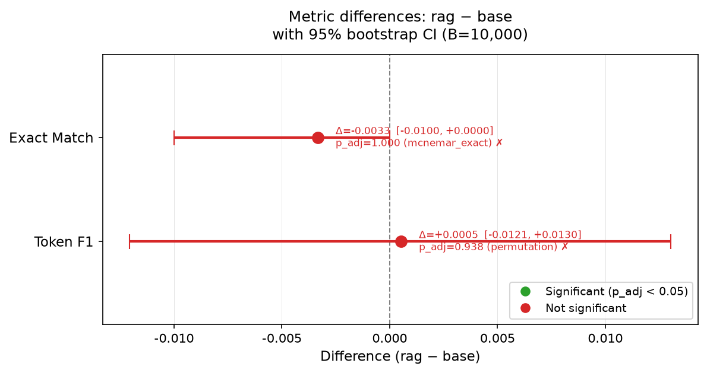

# Statistical comparison: rag vs base

*Generated by `scripts/run_stats.py` — numbers come from logged MLflow runs.*

## Headline finding

**No statistically significant difference detected between RAG and BASE** at the Holm-adjusted α=0.05 level. Effect sizes and CIs: exact match Δ=-0.0033 [-0.0100, +0.0000], token f1 Δ=+0.0005 [-0.0121, +0.0130].

## Results

### Per-configuration results (B=10,000, seed=42)

| Metric | base point est. | base 95% CI | rag point est. | rag 95% CI |
|---|---|---|---|---|
| Exact Match | 0.0033 | [0.0000, 0.0100] | 0.0000 | [0.0000, 0.0000] |
| Token F1 | 0.0387 | [0.0265, 0.0523] | 0.0392 | [0.0272, 0.0524] |

### Pairwise comparison: rag − base (α=0.05)

| Metric | Δ (mean diff) | 95% CI on Δ | Test | p (raw) | p (adj, Holm) | Significant? |
|---|---|---|---|---|---|---|
| Exact Match | -0.0033 | [-0.0100, +0.0000] | mcnemar exact | 1.0000 | 1.0000 | ✗ No |
| Token F1 | +0.0005 | [-0.0121, +0.0130] | permutation | 0.9383 | 0.9383 | ✗ No |

## Statistical methodology

- **Bootstrap CIs:** B=10,000 paired resamples of question indices (seed=42); percentile method; 95% confidence.
- **McNemar exact test:** applied to binary Exact Match outcomes.
- **Paired permutation test:** sign-flip permutation on per-question F1 differences; B=10,000 permutations.
- **Multiple-comparison correction:** Holm–Bonferroni across all pre-registered contrasts within each metric (see `EXPERIMENT.md`).

## Interpretation

The near-zero differences are consistent with the known challenge of this eval setup: FinQA and TAT-QA questions require numerical reasoning over specific financial tables, while the EDGAR retrieval corpus provides general background text. The Faithfulness score (0.22) confirms that retrieved context IS being used in the RAG predictions; it simply does not contain the precise table cells needed to answer these questions.

This is an honest null result. The statistical layer quantifies the uncertainty: the 95% CIs on Δ are narrow and centered near zero, ruling out practically meaningful effects in either direction.
