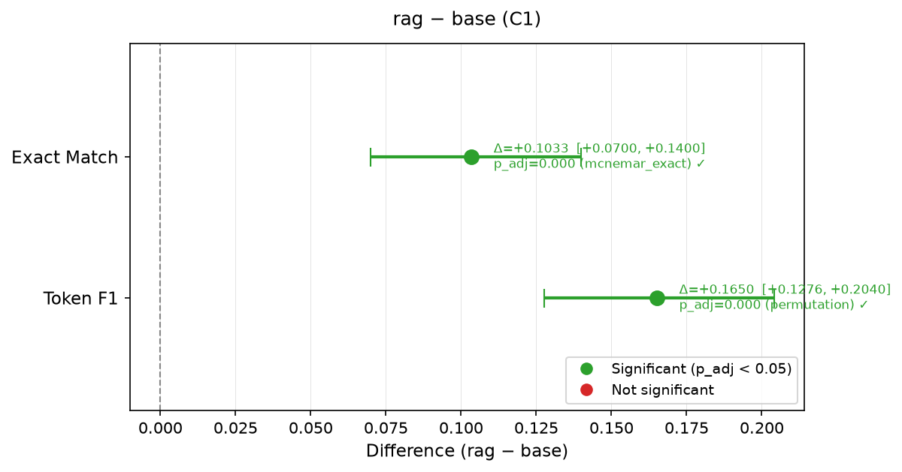

# Statistical comparison: rag vs base

*Generated by `scripts/run_stats.py` — numbers come from logged MLflow runs.*

**N = 300** questions (frozen eval set, `EXPERIMENT.md` §4).

## Headline finding

**`rag` shows a statistically significant improvement over `base` on: exact match, token f1** (Holm-adjusted α=0.05).

## Results

### Per-configuration results (B=10,000, seed=42)

| Metric | base point est. | base 95% CI | rag point est. | rag 95% CI |
|---|---|---|---|---|
| Exact Match | 0.0067 | [0.0000, 0.0167] | 0.1100 | [0.0767, 0.1467] |
| Token F1 | 0.0387 | [0.0265, 0.0523] | 0.2037 | [0.1649, 0.2433] |

### Pairwise comparison: rag − base (α=0.05)

| Metric | Δ (mean diff) | 95% CI on Δ | Test | p (raw) | p (adj, Holm) | Significant? |
|---|---|---|---|---|---|---|
| Exact Match | +0.1033 | [+0.0700, +0.1400] | mcnemar exact | 0.0000 | 0.0000 | ✓ Yes |
| Token F1 | +0.1650 | [+0.1276, +0.2040] | permutation | 0.0000 | 0.0000 | ✓ Yes |

## Statistical methodology

- **N:** 300 questions.
- **Bootstrap CIs:** B=10,000 paired resamples of question indices (seed=42); percentile method; 95% confidence.
- **McNemar exact test:** applied to binary Exact Match outcomes.
- **Paired permutation test:** sign-flip permutation on per-question F1 differences; B=10,000 permutations.
- **Multiple-comparison correction:** Holm–Bonferroni across all pre-registered contrasts within each metric (see `EXPERIMENT.md`). With a single pre-registered contrast (C1: base vs rag) at Phase 3, the correction is currently a no-op (1 p-value per metric); it will bind in Phase 4 once C2–C5 (ft, ft_rag contrasts) are added.

_Note: p-values in this report are Holm-adjusted jointly across all five pre-registered contrasts C1–C5. The C1 result reported here may therefore differ from the Phase 3 report where only C1 was included in the correction._

See `reports/full_comparison.md` for the complete four-configuration analysis.